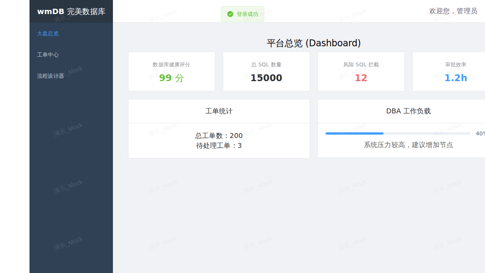

# wmDB 商业版操作手册

## 一、 系统介绍
wmDB (完美数据库) 是一款高可用、高安全性的企业级变更管控与自动化审批平台。商业版在一期框架的基础上，全面引入了国密算法（SM2/SM3/SM4）、多租户体系、OpenAPI 扩展、以及商业大盘监控能力。

## 二、 基础软件安装要求与下载地址

为确保 wmDB 商业版稳定运行，请在部署前准备以下基础环境（附官方下载地址）：

| 软件名称 | 版本要求 | 下载地址 |
| --- | --- | --- |
| **JDK** | 17+ | [Adoptium Temurin 17](https://adoptium.net/zh-CN/temurin/releases/?version=17) |
| **Maven** | 3.6+ | [Apache Maven](https://maven.apache.org/download.cgi) |
| **Node.js** | 20.x+ | [Node.js Official](https://nodejs.org/zh-cn/download/) |
| **MySQL** | 8.0+ | [MySQL Community Server](https://dev.mysql.com/downloads/mysql/) |
| **MinIO** | 最新版 | [MinIO Download](https://min.io/download) |
| **Redis** | 6.0+ | [Redis Download](https://redis.io/download/) |

## 三、 部署与启动步骤

### 1. 启动依赖组件
请确保 MySQL, Redis 和 MinIO 已启动并正常运行。并在后端的 `application.yml` 或环境变量中配置正确的连接信息，必须配置的变量如下：
- `WMDB_JWT_SECRET`：JWT 签名密钥
- `WMDB_MINIO_ENDPOINT`：MinIO 服务地址 (例如 `http://localhost:9000`)
- `WMDB_MINIO_ACCESS_KEY`：MinIO Access Key
- `WMDB_MINIO_SECRET_KEY`：MinIO Secret Key
- `WMDB_MINIO_BUCKET`：Bucket 名称 (默认 `wmdb`)

### 2. 后端服务启动
1. 进入后端目录：`cd backend`
2. 编译并打包：`mvn clean install -DskipTests`
3. 启动应用：`mvn spring-boot:run`

### 3. 前端服务启动
1. 进入前端目录：`cd frontend`
2. 安装依赖 (支持国密 sm-crypto)：`npm install`
3. 启动开发服务器：`npm run dev`

---

## 四、 核心功能与页面展示

### 1. 登录页面 (国密 SM2 保护)
使用实名制身份证号码登录，前端通过 **SM2 国密非对称加密算法** 加密密码后传输至后端，后端使用 **SM3** 校验数据库哈希。

*(登录页参考，使用 18 位身份证号码登录)*

### 2. 商业化大盘总览 (Dashboard)
登录成功后，系统会自动跳转至 Dashboard 平台总览。
在这里您可以直观地看到：
- **数据库健康评分**：基于巡检规则打分。
- **总 SQL 数量与拦截统计**：统计历史执行情况与被拦截的危险操作。
- **工单统计与 DBA 工作负载**：监控人员压力，辅助决策。



*(图: 大盘总览页面)*

### 3. 工单中心与多租户隔离
系统引入了 `TenantContextHolder` 支持企业 SaaS 化多租户。用户在左侧导航栏点击 **“工单中心”** 即可查看个人的 SQL 审核审批工单、查看审核状态 (`AUDITING`, `APPROVED` 等)，并且支持 OpenAPI 回调自动流转。

## 五、 OpenAPI 接入指南
系统现提供标准化的 `RESTful OpenAPI`。
企业内部 DevOps 或 CI/CD 平台可通过如下接口查询工单流转状态：
```http
GET /api/v1/openapi/ticket/{id}/status?applicantId=身份证号
```
返回结果遵循阿里巴巴 Java 规范 `00000` 状态码。

---
*版权所有 © wmDB 完美数据库商业版*
